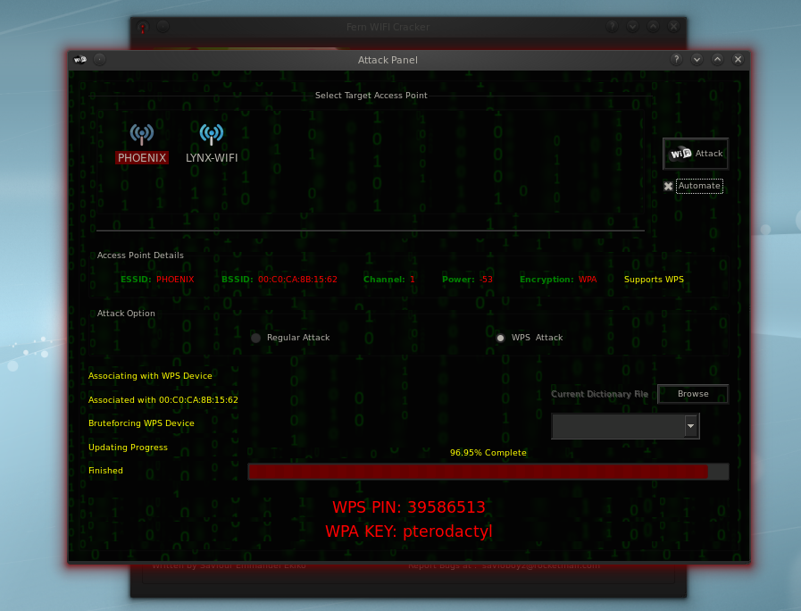
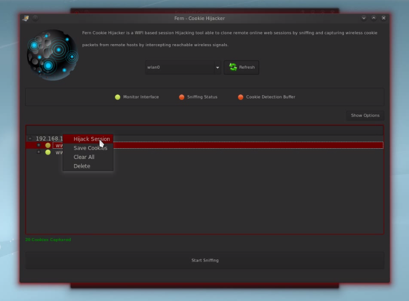

# Fern Wifi Cracker

***Fern Wifi Cracker*** is a Wireless security auditing and attack software program written using the [Python Programming Language](http://www.python.org/) and the [Python Qt GUI library](http://www.riverbankcomputing.co.uk/software/pyqt/intro). The program is able to crack and recover WEP/WPA/WPS keys and also run other network based attacks on wireless or ethernet based networks

## DISCLAIMER

Fern-Wifi-Cracker is designed to be used in testing and discovering flaws in one's own network with the aim of fixing the flaws detected, **DO NOT** use the program on networks for which you don't have permission, I am not responsible for whatever damage you cause by using this software.

-----

Visit [http://www.fern-pro.com](https://www.fern-pro.com) for professional version

[](http://www.fern-pro.com/)

## Supported operating systems

The Software runs on any *Linux machine* with the programs [prerequisites](#prerequisites). The program has been tested to work on the following Linux based operating systems:

1. [KDE/GNOME](http://www.ubuntu.com/Ubuntu)
2. [BackTrack Linux](http://www.backtrack-linux.org)
3. [BackBox Linux](http://www.backbox.org/)

## Prerequisites

The following dependencies can be installed using the *Debian package installer* command on Debian based systems using `apt-get install <program>` or otherwise downloaded and installed manually

1. [Aircrack-NG](http://www.aircrack-ng.org/)
2. [Python 3.x](http://www.python.org/)
3. [Python-Scapy](http://www.secdev.org/projects/scapy/)
4. [Python Qt5](http://www.riverbankcomputing.co.uk/software/pyqt/intro)
5. [Subversion](http://subversion.tigris.org/)
6. [Xterm](http://invisible-island.net/xterm/)
7. [Reaver](http://code.google.com/p/reaver-wps/) *(for WPS Attacks)*
8. [Macchanger](https://github.com/alobbs/macchanger)

## Features

*Fern Wifi Cracker* currently supports the following features:

1. *WEP Cracking with Fragmentation,Chop-Chop, Caffe-Latte, Hirte, ARP Request Replay or WPS attack*
2. *WPA/WPA2 Cracking with Dictionary or WPS based attacks*
3. *Automatic saving of key in database on successful crack*
4. *Automatic Access Point Attack System*
5. *Session Hijacking (Passive and Ethernet Modes)*
6. *Access Point MAC Address Geo Location Tracking*
7. *Internal MITM Engine*
8. *Bruteforce Attacks (HTTP,HTTPS,TELNET,FTP)*
9. *Update Support*

## Installation

Installation on Debian Package supported systems:

```shell
root@host:~# python3 execute.py
```

The *source code* for the program can be fetched using the following command on terminal:

```shell
root@host:~# git clone https://github.com/savio-code/fern-wifi-cracker.git
```

## Upgrading and Updating

 The Program automatically checks for updates each time the program is ran, if the program finds an update, it notifies
user with the message **New Update is Available**,  in other to update all you simply have to do is click on the update button
When the button is clicked, allow to download update files until it displays the message **Please Restart Application**

## Screenshots

### Main Window


### WPA Cracking with WPS Attack



### Cookie highjacking



## Other Projects

[https://github.com/savio-code/ghost-phisher](https://github.com/savio-code/ghost-phisher)

[https://github.com/savio-code/hexorbase](https://github.com/savio-code/hexorbase)

## Supporting

If you like Fern Wifi Cracker and would like to support the development, please do so through bitcoin: `1AoBfNLfwDrw4ofZXZVm9YfeaFCXtG9k9B`
